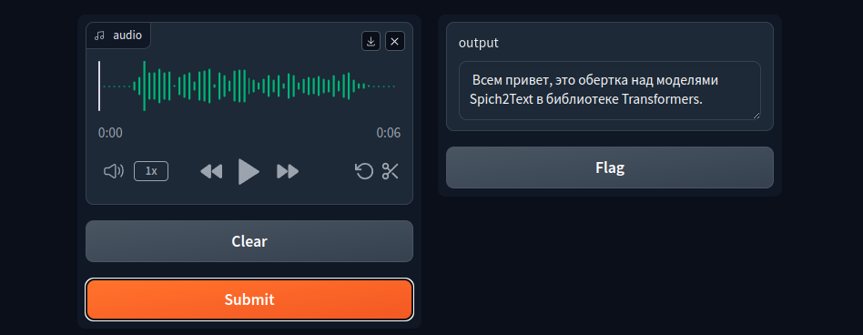

# Speech2text 

    


 

## What is it?
This project includes a wrapper around speech-to-text models from the Transformers library with a graphical interface provided by Gradio. Speech2Text is a modular project that can be integrated with other projects requiring a speech-to-text model. The server-side implementation is built on FastAPI. If needed, the project can be used independently by accessing the root page of the deployed project.




# Table of contents
```bash
speech2text_factory/
│
├── docker-compose.yml              # Docker Compose configuration file
├── dockerfile                      # Dockerfile for creating Docker container
├── LICENSE                         # License file
├── Makefile                        # Makefile for project automation
├── README.md                       # Project description and instructions
├── requirements.txt                # Python dependencies list for pip
├── docs/                           # Directory for documentation and design files
│   ├── index.html                  # Main HTML documentation file
│   ├── src/                        # Directory for source files used in documentation
│   └── style.css                   # CSS stylesheet for documentation styling
│
└── src/                            # Source code directory
    ├── ai_models/                  # Directory for AI model scripts
    │   ├── weights/                # Directory for model weights
    │   └── model.py                # Speech-to-text model script
    │
    ├── api/                        # Directory for API scripts
    │   ├── app/                    # Directory for application specific API scripts
    │   │   ├── crud.py             # Script for CRUD operations
    │   │   ├── endpoint.py         # Endpoint script
    │   │   ├── middleware.py       # Middleware script
    │   │   ├── models.py           # Models script
    │   └── main.py                 # Main API script
    │    
    ├── main.py                     # Main script
    └── utils/                      # Directory for utility scripts
        └── features_extractor.py   # Feature extractor script
```


# Installation

## Locally
To install all dependencies and run the project locally, follow these steps:

1. Build the project:
   ```sh
   make build
   ```
2. Navigate to the `src` directory:
   ```sh
   cd src
   ```
3. Run the main script from ```src``` directory:
   ```sh
   python3 main.py
   ```

Additionally, create a `.env` file with the variables `MODEL_NAME` and `USE_CUDA`. By default, these are set to `openai/whisper-small` and `True` respectively.

## Docker Installation
To build and run a Docker container with a specific Speech2Text model, follow these steps:

1. **Build the Docker image:**
   In the `speech2text` directory, run:
   ```sh
   docker build -t speech2text .
   ```
   This command creates a Docker image named `speech2text`.

2. **Run the Docker container:**
   ```sh
   docker run -p PORT:8000 --gpus all --name CONTAINER_NAME --env MODEL_NAME="model-name" --env USE_CUDA="True" speech2text
   ```
   Replace `PORT` with the port number on which you intend to run the container and `model-name` with the desired speech-to-text model.

Explanation:
- `-p PORT:8000`: Maps `PORT` on your host to port 8000 in the container.
- `--gpus all`: Allocates all available GPUs to the container.
- `--name CONTAINER_NAME`: Assigns a name to the container.
- `--env MODEL_NAME="model-name"`: Sets the environment variable `MODEL_NAME` in the container.
- `--env USE_CUDA="True"`: Sets the environment variable `USE_CUDA` in the container.

To use CUDA in container you have to install ```nvidia-docekr2```. Just run this comand in cmd
```bash
sudo apt-get install -y nvidia-docker2 
```


# API Endpoints

| Endpoint                  | Description                                      |
|---------------------------|--------------------------------------------------|
| `/`                       | Return a greeting site.                          |
| `/predict`                | Return a result of speech2text model.            |
| `/get-config`             | Return the config of the model.            |

# Contribution

Feel free to open an issue or submit a pull request.
